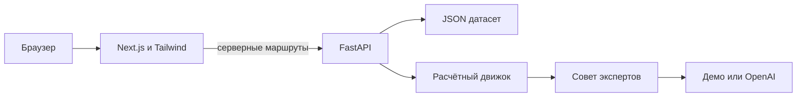

# AQYL — «Аким на 5 часов»

Учебный AI-симулятор управления городом от команды **ILON**. Пользователь принимает пять решений, а расчётный движок и совет экспертов объясняют их влияние на качество жизни.

**Фаза 1: инфраструктура.** В репозитории есть FastAPI backend, диагностическая страница Next.js, запуск через Docker Compose и автоматические проверки. Игровой интерфейс относится к следующему этапу.

**Текущая модель — предварительный прототип:** 4 района, 5 показателей, 10 мероприятий, бюджет 10 000 000 условных тенге. Переход к предоставленному датасету с 5 районами, 10 показателями, 14 мероприятиями и бюджетом 100 запланирован на фазу 2. Формула организаторов пока не реализована в коде.

## Запуск одной командой

Нужны Git и запущенный Docker с Compose v2. При первой сборке нужен интернет для загрузки образов и зависимостей.

Из корня клонированного репозитория:

```bash
docker compose up --build
```

Файл `.env` и API-ключ для этого не нужны: по умолчанию включён `AI_PROVIDER=demo`. Дождитесь, пока оба сервиса запустятся.

- Приложение: http://localhost:3000
- Документация FastAPI: http://localhost:8000/docs
- Проверка backend: http://localhost:8000/health
- Проверка frontend: http://localhost:3000/health

На странице должны появиться «Сервер подключён», демонстрационный режим и версия датасета, полученная от backend. Это проверка инфраструктуры; выбор мероприятий ещё не добавлен.

Запуск в фоне с ожиданием готовности:

```bash
docker compose up --build --detach --wait --wait-timeout 120
docker compose ps
```

У обоих сервисов должен быть статус `healthy`. Просмотр логов и остановка:

```bash
docker compose logs --follow
docker compose down
```

Если порты заняты, задайте другие внешние порты:

```bash
WEB_PORT=3100 API_PORT=8100 docker compose up --build
```

Тогда приложение доступно на http://localhost:3100, документация API — на http://localhost:8100/docs. Внутренняя связь контейнеров остаётся через `backend:8000`.

## Локальная разработка

Стек: **Python 3.12, FastAPI, Node.js 24, Next.js 16.3.6, React 19, TypeScript и Tailwind CSS 4**. Версии Python и Node указаны в `.python-version` и `.nvmrc`. Нужные версии runtime должны быть установлены перед выполнением команд.

Backend, первый терминал:

```bash
cd backend
python3.12 -m venv .venv
source .venv/bin/activate
python -m pip install --require-hashes -r requirements-dev.txt
uvicorn app.main:app --reload --host 127.0.0.1 --port 8000
```

Frontend, второй терминал:

```bash
cd frontend
npm ci
npm run dev
```

В режиме разработки Next.js по умолчанию обращается к `http://127.0.0.1:8000`. Для другого адреса:

```bash
API_INTERNAL_URL=http://127.0.0.1:8100 npm run dev
```

Также можно задать `API_INTERNAL_URL` в `frontend/.env.local`. Корневой `.env` используется backend и Compose; Next.js автоматически его не читает. Режим разработки автоматически подхватывает изменения. Compose запускает собранные образы, поэтому после изменения кода нужна повторная сборка.

## Окружение и AI

Все доступные настройки описаны в `.env.example`. Для изменения настроек Compose или backend создайте корневой `.env`:

```bash
cp .env.example .env
```

| Переменная | По умолчанию | Назначение |
| --- | --- | --- |
| `AI_PROVIDER` | `demo` | `demo` — программные примеры; `openai` — реальные запросы к модели |
| `OPENAI_API_KEY` | пусто | API-ключ, используется только backend |
| `OPENAI_MODEL` | пусто | ID доступной вашему API-проекту модели с поддержкой Structured Outputs |
| `OPENAI_TIMEOUT_SECONDS` | `45` | Таймаут одного запроса SDK к модели |
| `WEB_PORT` | `3000` | Внешний порт frontend в Compose |
| `API_PORT` | `8000` | Внешний порт backend в Compose |
| `API_INTERNAL_URL` | `http://127.0.0.1:8000` локально | Серверный адрес backend для Next.js; в Compose установлен в `http://backend:8000` |

В `openai`-режиме обязательны ключ и модель. Полный совет выполняет шесть запросов: три оценки и три ответа коллегам. При ошибке модели backend сообщает об ошибке; он не подменяет ответ демонстрационным.

Настоящие AI-запросы не входят в проверки фазы 1. Статус подключения на странице подтверждает доступность API и каталога, а не доступ к модели OpenAI. Секреты не передаются frontend и не включаются в Docker-образы. Файлы `.env` и локальные окружения исключены из Git.

## Проверки

В окружении backend:

```bash
cd backend
source .venv/bin/activate
ruff check .
pytest -q
```

Для frontend:

```bash
cd frontend
npm ci
npm run lint
npm run typecheck
npm run build
```

Production-сборка frontend выполняется без работающего backend и без API-ключей. `typecheck` сначала генерирует типы маршрутов Next.js, затем запускает TypeScript.

Браузерная проверка требует работающего приложения в режиме `demo`:

```bash
cd frontend
npx playwright install chromium
npm run test:e2e
```

Для нестандартного порта задайте `PLAYWRIGHT_BASE_URL=http://127.0.0.1:3100`. Тесты проверяют данные реального backend, обработку ошибки и повторный запрос, а также узкий экран.

GitHub Actions запускается при push в `main` и вручную. Задания: Python-тесты и Ruff; ESLint, TypeScript и сборка Next.js; Docker Compose и Playwright. Интеграция использует порты 3100/8100, проверяет реальную остановку и восстановление backend. При сбое сохраняются логи контейнеров и отчёт Playwright. CI работает без AI-ключей и внешних модельных вызовов.

## Фиксация зависимостей

`backend/requirements.in` и `backend/requirements-dev.in` — прямые зависимости. Файлы `.txt` содержат точные версии и SHA-256 хеши, сформированные pip-tools. Версии runtime-зависимостей в development-наборе ограничены файлом `requirements.txt`.

Для обновления под Python 3.12:

```bash
cd backend
source .venv/bin/activate
python -m pip install pip-tools==7.6.1
pip-compile --generate-hashes --strip-extras --resolver=backtracking --output-file=requirements.txt requirements.in
pip-compile --generate-hashes --strip-extras --resolver=backtracking --output-file=requirements-dev.txt requirements-dev.in
python -m pip install --require-hashes -r requirements-dev.txt
```

После обновления проверить тесты и Docker-сборку. В frontend фиксируются `package.json` и `package-lock.json`, воспроизводимая установка выполняется через `npm ci`.

## Архитектура и API



Браузер обращается к тому же адресу, с которого загружена страница. Next.js проксирует только явно заданные маршруты, использует таймаут 5 секунд и отключает кеширование. Адрес backend выбирается во время запуска сервера, а не сборки frontend.

| Маршрут frontend | Назначение |
| --- | --- |
| `GET /health` | Состояние самого frontend, независимо от backend |
| `GET /api/health` | Прокси к `/health` FastAPI |
| `GET /api/catalog` | Прокси к `/api/v1/catalog` FastAPI |

Недоступный backend даёт ответ 502, превышение таймаута — 504. Страница показывает ошибку и кнопку повторной попытки. Подробности внутренних ошибок не передаются браузеру.

Дополнительно backend содержит `POST /api/v1/simulate` и `POST /api/v1/council/stream`. Эти маршруты используют прежнюю модель и ещё не подключены к интерфейсу.

## Следующая фаза и документы

Следующий этап — привести движок к [датасету и правилам](docs/DATASET_AND_RULES.md): 5 районов, 10 показателей, 14 мер, бюджет 100, лаги, синергии и несовместимости.

Целевая формула:

```text
Score = 0.7 × средний балл по населению + 0.3 × балл слабейшего района − число показателей ниже 40
```

Контрольные значения: база 52.55768; пример за 95 единиц — 56.54307. Эти значения проверены отдельно по датасету, но пока не являются результатами текущего backend.

- [Исходное ТЗ](docs/PROJECT_BRIEF.md) и [Word-документ](docs/Akim_Project_Brief.docx).
- [Датасет в Word](docs/Astana_Dataset_and_Rules.docx).
- [Описание предварительной математической модели](docs/BACKEND_PROTOTYPE.md) — исторический документ до фазы 1.
- [План дальнейшей работы](docs/ROADMAP.md).

Сравнение сценариев, метод Шепли, неожиданные события и экспорт отчётов остаются дальнейшими задачами. Данные — учебная модель, не прогноз реальных городских последствий.

Разработка, коммиты и push выполняются непосредственно в `main` с сохранением обновлений команды.
