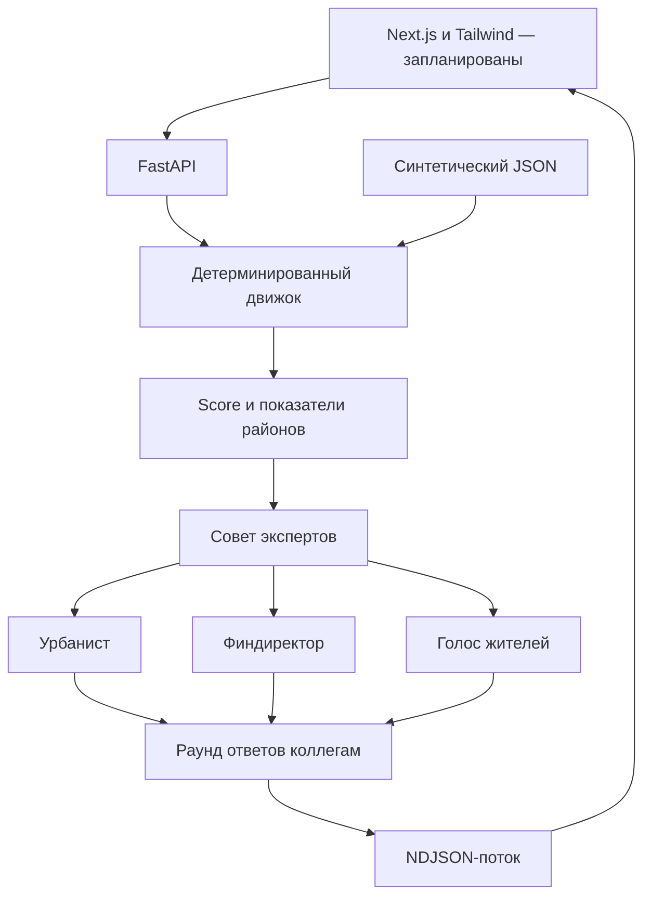

# Аким на 5 часов

AI-симулятор управления городом для хакатона. Команда ILON.

Пользователь распределяет одинаковый для всех бюджет между пятью направлениями: транспорт, озеленение, социальная инфраструктура, безопасность и городской сервис. Движок рассчитывает Astana Quality of Life Score, а совет из трёх экспертов обсуждает последствия решений.

## Текущее состояние

Это промежуточный коммит фундамента проекта. Подготовлены:

- FastAPI API с каталогом, расчётом сценария и потоком ответов совета.
- Синтетический датасет четырёх районов, десять мероприятий и бюджет 10 000 000 условных тенге.
- Проверка пяти решений, допустимых мероприятий, шага сумм и общего бюджета на сервере.
- Детерминированная модель Score и изменения показателей районов.
- Совет из урбаниста, финдиректора и голоса жителей: оценки первого раунда и ответы коллегам во втором.
- Отдельные режимы `demo` и `openai`, структурированные ответы и явное сообщение об ошибке AI.
- Исходники тестов движка, API и совета; тесты пока не запускались.
- ТЗ и критерии хакатона в Markdown и Word.

**Ещё не готовы:** frontend Next.js + Tailwind, Dockerfile и Docker Compose, фиксация точных версий зависимостей, CI и проверка запуска приложения. Установка зависимостей в рабочей среде была прервана сетевым ограничением. Сквозной запуск и реальный OpenAI-вызов пока не проверены.

## Структура

```text
backend/
  app/                  # FastAPI, схемы, движок, совет экспертов
  data/city.v1.json     # Синтетические данные и пример сценария
  tests/                # Проверки API, бюджета, Score и AI-оркестрации
  requirements.in      # Прямые зависимости приложения
  requirements-dev.in  # Зависимости разработки
docs/
  PROJECT_BRIEF.md      # Исходное ТЗ и первоначальный план
  Akim_Project_Brief.docx
  ROADMAP.md            # Продолжение инфраструктуры и идеи развития
.env.example
```

Документы `PROJECT_BRIEF.md` и `Akim_Project_Brief.docx` сохраняют первоначальное обсуждение до реализации. Актуальное состояние кода описано в этом README.

## Подготовка локального запуска backend

Нужен Python 3.12 или новее. Следующие команды описывают предусмотренный запуск; его проверка ещё не завершена.

```bash
cp .env.example .env
cd backend
python3 -m venv .venv
source .venv/bin/activate
python -m pip install -r requirements-dev.in
uvicorn app.main:app --reload --host 127.0.0.1 --port 8000
```

После запуска интерактивная документация доступна по адресу `http://localhost:8000/docs`.

```bash
# Из backend, в активированном окружении
pytest
ruff check .
```

Режим по умолчанию `AI_PROVIDER=demo` использует программные шаблоны и не делает запросов к модели. Это демонстрация протокола совета, а не настоящий AI-анализ.

Для реального совета задайте в корневом `.env`:

```dotenv
AI_PROVIDER=openai
OPENAI_API_KEY=your-key
OPENAI_MODEL=your-supported-model-id
```

Нужна модель с поддержкой Structured Outputs в Responses API. Один полный совет выполняет шесть модельных запросов: три оценки и три ответа коллегам. API-ключ остаётся на сервере. Файлы `.env` исключены из Git. При ошибке провайдера поток выдаёт `error` и не подменяет ответ демонстрационным.

## API

| Метод | Маршрут | Назначение |
| --- | --- | --- |
| GET | `/health` | Состояние API, режим совета, версия датасета |
| GET | `/api/v1/catalog` | Датасет, мероприятия, бюджет и стартовый сценарий |
| POST | `/api/v1/simulate` | Проверка и расчёт пяти решений |
| POST | `/api/v1/council/stream` | NDJSON-поток: `simulation`, `mode`, `review`, `reply`, `done` или `error` |

Вход обоих POST-маршрутов — объект `default_scenario` из `backend/data/city.v1.json`. Клиент передаёт направление, ID района, ID мероприятия и сумму. Размер общего бюджета и коэффициенты берутся из серверного датасета.

## Математическая модель

Все показатели лежат в диапазоне от 0 до 100, где больше — лучше. Бюджет задаётся целым числом условных тенге с шагом 250 000. На одно решение допускается от 500 000 до 4 000 000.

Положительный эффект мероприятия:

```text
delta = (amount / 1 000 000) × coefficient × (1 − baseline_metric / 100)
```

Отрицательный эффект: `delta = (amount / 1 000 000) × coefficient`. Все эффекты суммируются относительно исходных показателей, затем результат ограничивается диапазоном 0–100. Порядок решений не влияет на результат.

Городской показатель направления — среднее показателей районов с весами по синтетическому населению. Итоговый Score — среднее пяти городских показателей с равными весами. Результат округляется до трёх знаков только при формировании ответа. ID сценария зависит от содержимого датасета и решений.

AI объясняет рассчитанные результаты и обсуждает компромиссы. Непроверенные коэффициенты модели не меняют числовой Score. Рекомендации совета пока текстовые; для применения их нужно выразить новым сценарием и снова проверить через API.

Данные, цены, население и эффекты вымышлены. Названия районов не означают, что цифры отражают реальную Астану. Окупаемость, динамика налогов и общественное мнение в этой версии не моделируются.

## Архитектура



Интеграция использует [OpenAI Structured Outputs](https://developers.openai.com/api/docs/guides/structured-outputs). Фиксация зависимостей, контейнеризация и frontend — следующие шаги.
